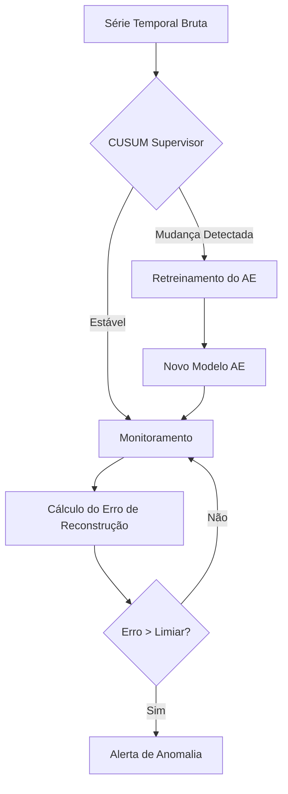

# 25_2-Detec-ao_de_Pontos_de_Mudan-a_em_S-ries_Temporais_Usando_Autoencoders
**Título do TCC:** Detecção de Pontos de Mudança em Séries Temporais Usando Autoencoders
**Alunos:** Anthony Viegas Heimlich e Gabriel Alves Giuliano
**Semestre de Defesa:** 2025-2

# TL;DR
Para rodar a análise principal (Integração AE + CUSUM):

Abra o projeto no RStudio.

Instale as dependências: install.packages(c("daltoolbox", "harbinger", "united", "ggplot2", "dplyr", "gridExtra", "caret")).

Execute o script principal:
```bash
source("AE_CUSUM_Final.R")
```
# Descrição Geral
O trabalho aborda o problema da não-estacionariedade (concept drift) em séries temporais industriais. A solução desenvolvida utiliza o algoritmo CUSUM Tabular como um supervisor de estabilidade que monitora o erro de reconstrução de um Autoencoder. Quando uma mudança de regime operacional é detectada, o sistema aciona automaticamente o retreinamento do modelo neural, garantindo que ele se adapte às novas condições do poço sem intervenção manual constante.

Os dados utilizados são provenientes do 3W Dataset (Petrobras), focando em eventos de Fechamento Espúrio de DHSV (Tipo 1) e Instabilidade de Fluxo (Tipo 4).

# Funcionalidades
* **Supervisão Estatística (CUSUM Adaptativo):**
  
  * Monitoramento contínuo da série temporal ou do erro de reconstrução.
  
  * Detecção de mudanças de média com limiares dinâmicos baseados em desvio padrão ($\sigma$).
  
  * Gatilho automático para retreinamento de modelos.

* **Detecção de Anomalias com Autoencoder:**
  
  * Implementação de Autoencoder Vanilla via pacote daltoolbox.
  
  * Reconstrução de séries temporais usando janelas deslizantes (Sliding Window).

* **Avaliação de Desempenho:**
  
  * Cálculo de métricas robustas para dados desbalanceados: F1-Score, Precisão e Recall.
  
  * Avaliação com tolerância temporal (Soft Evaluation) usando a biblioteca harbinger.
  
  * Análise de Atraso de Detecção (Detection Delay).

* **Visualização Rica:**
  
  * Gráficos interativos com ggplot2 mostrando a série original, zonas de treino (verde), zonas de retreino (roxo) e pontos de detecção.
 

# Arquitetura
O fluxo de processamento segue uma abordagem de aprendizado online supervisionado por estatística:


# Dependências
O projeto foi desenvolvido em linguagem R e depende dos seguintes pacotes:

* daltoolbox: Biblioteca principal para Deep Learning e Autoencoders.

* daltoolboxdp: Extensão para modelos de Deep Learning (opcional, dependendo da versão).

* harbinger: Framework para detecção de eventos e avaliação soft.

* united: Acesso padronizado ao 3W Dataset e outros conjuntos de dados.

* ggplot2: Visualização de dados.

* caret: Cálculo de matriz de confusão e métricas.

* dplyr, gridExtra, zoo: Manipulação de dados e layout gráfico.

Para instalar todas as dependências no R:
```bash
install.packages(c("daltoolbox", "harbinger", "united", "ggplot2", "dplyr", "gridExtra", "caret", "zoo"))
```

(Nota: Certifique-se de ter o ambiente Python configurado se usar a versão do daltoolbox baseada em PyTorch/TensorFlow).

# Execução
O repositório contém scripts modulares. A ordem recomendada de execução para reproduzir os resultados do TCC é:

GLR_Baseline.R: Executa o método estatístico clássico (Baseline) para comparação.

CUSUM_Adaptativo.R: Demonstra o funcionamento isolado do supervisor estatístico na série bruta.

AE_CUSUM_Final.R: Executa a solução final proposta (Integração completa).

Para rodar qualquer um dos arquivos via terminal:
```bash
Rscript AE_CUSUM_Final.R
```

Ou abra os arquivos .R no RStudio e execute linha a linha (Ctrl+Enter) para visualizar os gráficos interativamente.
